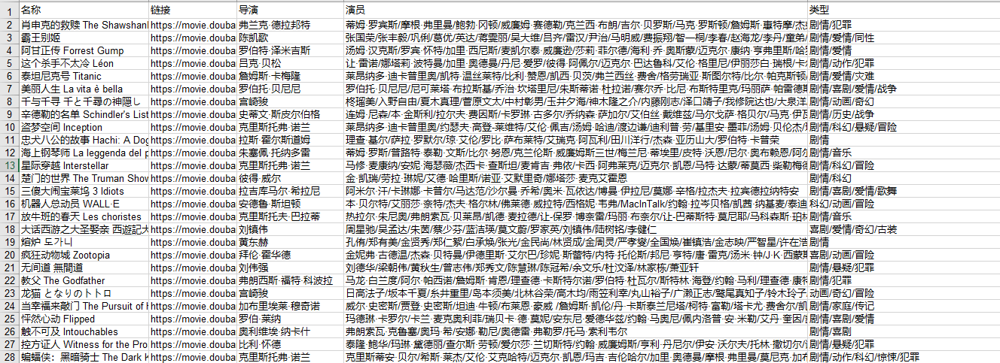
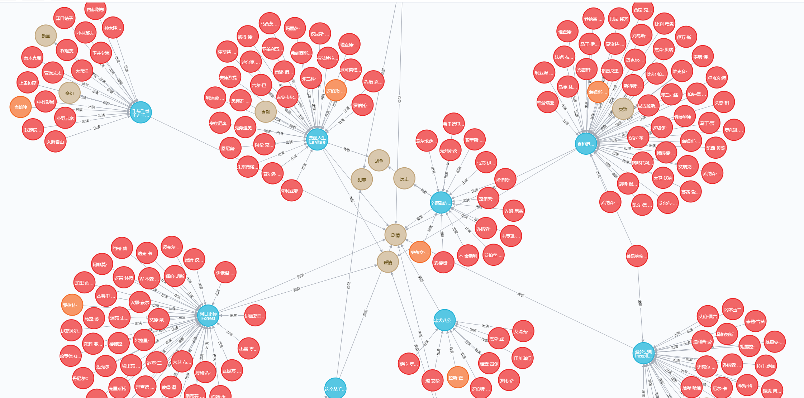

# 豆瓣爬虫与图数据库建立
## Feature  
****************
本项目使用python和neo4j数据库建立豆瓣最佳250部电影知识图谱。主要分为两步： 
1. 从[豆瓣](https://movie.douban.com/top250)爬取最佳的250部电影，内容包括电影名，链接，导演，演员，电影类型，以excel形式存储。  
2. 提取四类节点：电影、导演、演员、类型，提取节点之间的关系，在neo4j数据库上建立知识图谱。  

## Request
要使用本项目，你需要安装以下依赖库（python3）。
> requests  
bs4  
xlwt  
xlrd  
pandas  
py2neo

## Usage
****************
- 爬取内容  
```shell
python ./douban_spider.py
``` 
- 构建电影图
```shell
# 为了避免生成的图太大，可以修改构建电影图的电影数number（1-250）
python ./nep4j.py --number 5
``` 
## Examples
- 爬取结果

- 电影图



